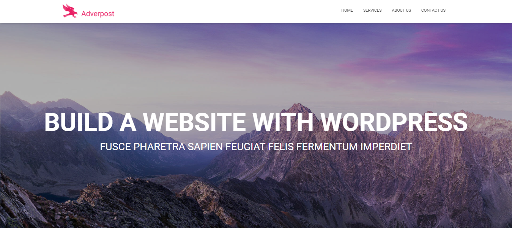

Advertsport is a showcase web site is a website used to present the products and services offered by a company or small business to the customer, reinforcing the perception of the brand. It is therefore not a complex site with personalized services and online stores, but simply a “business card” with which to display an online digital display window.

## Table of contents
* [General info](#general-info)
* [Demo](#demo)
* [Screenshots](#screenshots)
* [Technologies](#technologies)
* [Setup](#setup)
* [Features](#features)
* [Status](#status)
* [Contact](#contact)
* [License](#license)

## General info
Advertsport  acting as a showcase of your business, but on the internet. It allows you to highlight your products, your services, your realizations, a reservation system and much more, without selling online.

This site is therefore essential to optimize your business by touching more your target or even by touching a new target. Beside your customers, it is also convenient to have a website for your current and new partners so that they can, for example, better understand your business.

## Demo

## Screenshots

## Technologies
* Wordpress - version 5.6

## Setup

## Features

 - Increase your visibility through traffic generated on the website
 - Expand the target audience and thus reach exactly more people
 - Get new customers and build loyalty among your existing customers
 - Have access to your information at any time of the day or night
 - Create a more professional image of the company
 - Save time by already answering questions your customers may have

## Status
Project is: _finished_

## Contact
contact@delta-dev-software.com

## License
<a href="license.txt">MIT License</a>